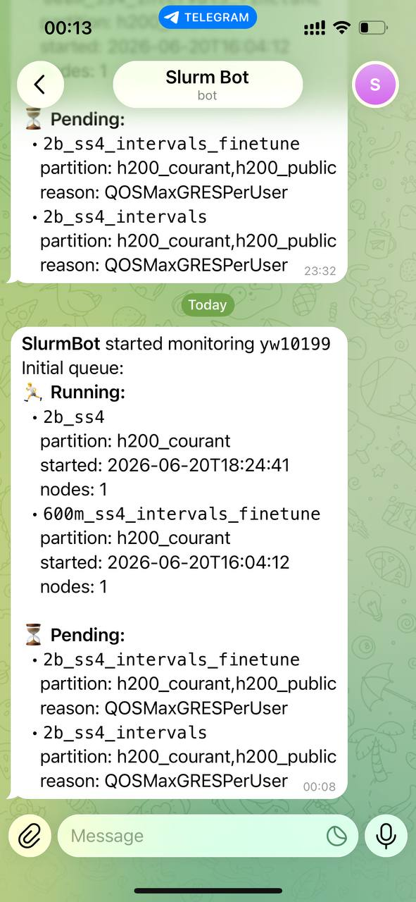

# 🤖 SlurmBot

1. Start chat with Telegram Bot [@slurm_603_bot](https://t.me/slurm_603_bot).

2. Get your Telegram ID.

> 1. Open Telegram and search for [@userinfobot](https://t.me/userinfobot)
> 2. Send `/start` — it replies with your numeric chat ID
> 3. Paste that ID when the installer asks for it

3. Run the installer on your HPC Login Node.



```bash
bash <(curl -sSL https://raw.githubusercontent.com/wyy603/SlurmBot/refs/heads/master/src/install.sh)
```

---

## ✨ What It Does

SlurmBot is a lightweight background daemon that monitors your **Slurm job queue** on an HPC cluster and sends **real-time Telegram notifications** whenever your jobs change state — new jobs submitted, jobs completed, or state transitions (pending → running, etc.).

You get a message on Telegram that looks like:

```
SlurmBot — jobs changed for yw10199

🆕 New jobs:
  • train_gpt2_large
    partition: gpu
    reason: Priority

✅ Completed / gone:
  • eval_baseline
    partition: cpu
    started: 2025-06-20T14:32:00

🔄 State changed:
  • preprocess_data
    partition: gpu
    started: 2025-06-20T15:01:00
    nodes: 2
```

**No more `squeue` refreshing.** SlurmBot watches for you.

---

## 🔧 How the Installer Works

Running the one-liner above will:

| Step | What happens |
|------|-------------|
| **1. Preflight** | Checks that `curl`, `jq`, and `squeue` are available |
| **2. Prompts** | Asks for your **Slurm username** and **Telegram chat ID** (interactively) |
| **3. Fetch** | Downloads the server script and config template from GitHub |
| **4. Config** | Writes `~/.slurmbot/config.json` with your answers, locked to `600` |
| **5. Shell hooks** | Appends a startup fragment to `~/.bashrc` and `~/.zshrc` so the server launches on every login |
| **6. Launch** | Starts `slurmbot-server.sh` immediately as a background daemon |

### What gets installed

```
~/.slurmbot/
├── slurmbot-server.sh    # The monitoring daemon (fetched from GitHub)
├── config.json            # Your user + Telegram config (permissions: 600)
├── server.log             # Daemon logs (grows over time)
└── last_squeue.txt        # Internal state snapshot
```

### How it stays alive

Every new shell (`bash` or `zsh`) checks if the server is running and starts it if not. This means SlurmBot launches on login and keeps running until the login node reboots — your next login will bring it back automatically.

---

## 🧱 Requirements

- **HPC login node** with `squeue` available
- `curl`, `jq`, `bash`
- A **Telegram bot token** (already baked into the config template)

---

## 🔒 Security Note

The config file at `~/.slurmbot/config.json` contains your Telegram bot token and chat ID. The installer sets its permissions to `600` (owner read/write only). Keep it private.

---

## 📁 Project Structure

```
src/
├── install.sh              # One-liner installer (the entry point)
├── slurmbot-server.sh      # Main daemon — polls squeue, diffs, sends Telegram messages
├── config.template.json    # Config template with bot token pre-filled
├── .bashrc                 # Shell fragment appended to ~/.bashrc
└── .zshrc                  # Shell fragment appended to ~/.zshrc
```
